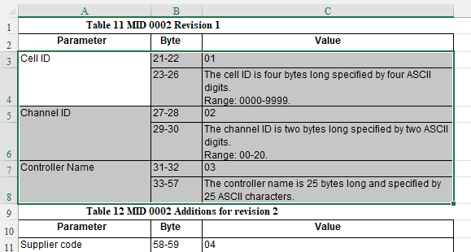
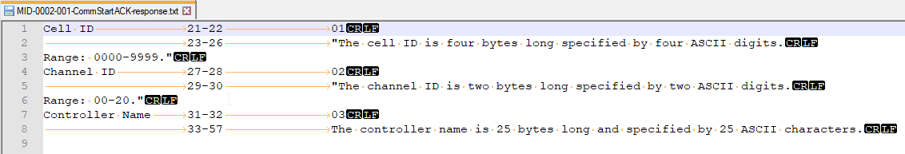
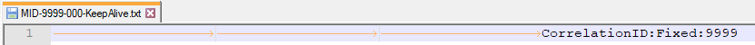

# Open Protocol specification to Service Description converter

## Introduction

Open Protocol was developed by Atlas Copco and is used to communicate with Atlas Copco Tightening Controllers. To virtualize those tightening controllers in Micro Focus Service Virtualization (SV), users can use Fixed Length over TCP protocol. To create virtual services based on that protocol users need to create a fixed length service description files as described in [Service Virtualization help](https://admhelp.microfocus.com/sv/en/latest/Help/Content/UG/t_fixed_length.htm). This process can be very time consuming and error prone and that was the reason why this tool was created. It should safe you >90% of time required.

Open Protocol supports these communication mediums:
- serial line
- TCP/IP

We are concerned with TCP/IP only going forward.

## How to create a virtual service with help of this tool

High level overview of the process:

1. Manually prepare MID specification files
   1. [Export Open Protocol Specification from PDF to Excel](#export-open-protocol-specification-from-pdf-to-excel)
   1. [Copy-paste individual MIDs to separate files](#copy-paste-individual-mids-to-separate-files)
   1. [Inspect the files for any inconsitencies and fix them](#inspect-the-files-for-any-inconsitencies-and-fixthem)
   1. [Add correlation information if needed](#add-correlation-information-if-needed)
1. Run `ops2sd <source folder> <target folder>` to convert MID specification files to SV Fixed Length Service Description files
1. Create virtual service based on the SV Fixed Length Service Description files

## How to obtain specification

The specification PDF is on multiple places, but not on Atlas Copco website:
- https://github.com/st-one-io/node-open-protocol/blob/master/docs/OpenProtocolSpecification_R280.pdf
- https://kupdf.net/download/atlas-copco-open-protocol-v75_597b8403dc0d607f1c2bb189_pdf

## Preparation of MID specification files

### 1. Export Open Protocol Specification from PDF to Excel

Open file in Adobe Acrobat and select File -> Export To -> Spreadsheet -> Microsoft Excel

### 2. Copy-paste individual MIDs to separate files

Let's say you want to create MID specifiaction file for MID 0002 revision 1. Find relevant table in Excel and copy it to clipboard

Now create a file with name MID-0002-001-CommStartACK-response.txt and paste the content into it. It should look like this:

To understand the file naming convention see MID Specification [filename format](#filename-format). 

### 3. Inspect the files for any inconsitencies and fix them

Sometimes the copy-pasted content might contain some unexpected formatting, which ops2sd cannot handle. For example it can happen there are multiple tab characters where it should be only one.

### 4. Add correlation information if needed

This is something, which must be done manually based on the specification information. For example it is crucial to correlate Keep Alive messages otherwise Keep Alive response could be associated as a response to any other request. For Keep Alive this can be done by specifying `CorrelationID:Fixed:9999` preceeded by 3 tab characters.

For more information on how to define correlation see [Correlation Specification](#correlation).

## MID Specification file Specification

### Filename format

MID-\{MID\}-\{REVISION\}-[\{OPERATION NAME\}]-[\{SCOPE\}].txt

- \{MID\} - 4 ASCII characters
- \{REVISION\} - 3 ASCII characters
- \{OPERATION NAME\} - optional operation name
- \{SCOPE\} - optional scope of the type. Can be "request" or "response". If left blank type can be used for both.

Examples:
- MID-0001-001-CommStart.txt
- MID-0035-001.txt
- MID-0038-002-SelectJob-request.txt

In case of MID 0060 "Last tightening result data subscribe" REVISION is not a revision of the request message, but revision of the requested subscribed event - e.g. 0061.006. This means that there will be 0060.001 to 0060.006 all with same structure - we should not include 0060 revision in type selection. We however need to include revision for the type selection of the response 0061.001 to 00061.006.

### Content Format

Content of the specification follows majority of the message format tables in the Open Protocol specification PDF. Majority of the parameters are specified on the two lines (see Line 1, Line 2), but some are using just one line (see Line 1).

Property specification consits of usually two lines where individual fields are delimited by a tab character. If no second line is used, then only Line 1 is:
- Line 1: \{property-name\}\{TAB\}\{occupied-bytes\}\{TAB\}\{property-id\}\{TAB\}\{correlation\}
  - \{property-name\} - name of the property
  - \{occupied-bytes\} - \{start-byte-offset\}-\{end-byte-offset\} - property ID always occupies 2 bytes. E.g. "21-22"
  - \{property-id\} - value of property ID - e.g. "01", "02", "03", ...
  - \{correlation\} - correlation data are optional and not part of the specification. Can be manually added by user. For more information see below.
- Line 2: \{TAB\}\{TAB\}\{occupied-bytes\}\{TAB\}\{description\}\{TAB\}\{correlation\}
  - {occupied-bytes\} - can be one or multiple bytes:
    - 1 byte format: \{byte-offset\}
    - multiple bytes format: \{start-byte-offset\}-\{end-byte-offset\}. For last parameter in the specification, you can use "?" questionmark to indicate length of the parameter varies. Such setup is usually used for data, which doesn't need to be or cannot be structured due to its variable-length nature.
  - \{correlation\} - correlation data are optional and not part of the specification. Can be manually added by user. For more information see below.

#### Correlation

It is necessary to specify correlation for some types, so generated Service Descriptions have this information as well and SV can pair correct response to correct request.

Format:
CorrelationID:\{CorrelationType\}:\{CorrelationDetails\}

  - \{CorrelationType\} - "Fixed" or "Payload". For "Fixed" \{CorrelationDetail\} must contain the value, which should be used for correlation. For "Payload" \{CorrelationDetail\} must contain comma-separated possible values present in the payload.

Examples:

  - CorrelationID:Fixed:0038
  - CorrelationID:Payload:0034,0070

If it doesn't make sense to link correlation to a particular property, you can specify it on the first line and it will be placed in the header. In this case just omit all the usual information like \{property-name\} and specify just the correlation data.

#### Examples of a property definition:
<pre>
Cell ID{TAB}21-22{TAB}01
{TAB}{TAB}23-26{TAB}"The cell ID is four bytes long specified by four ASCII digits. Range: 0000-9999."
</pre>

<pre>
Sequence number support{TAB}174-175{TAB}12
{TAB}176{TAB}Flag sequence number handling supported if = 1
</pre>